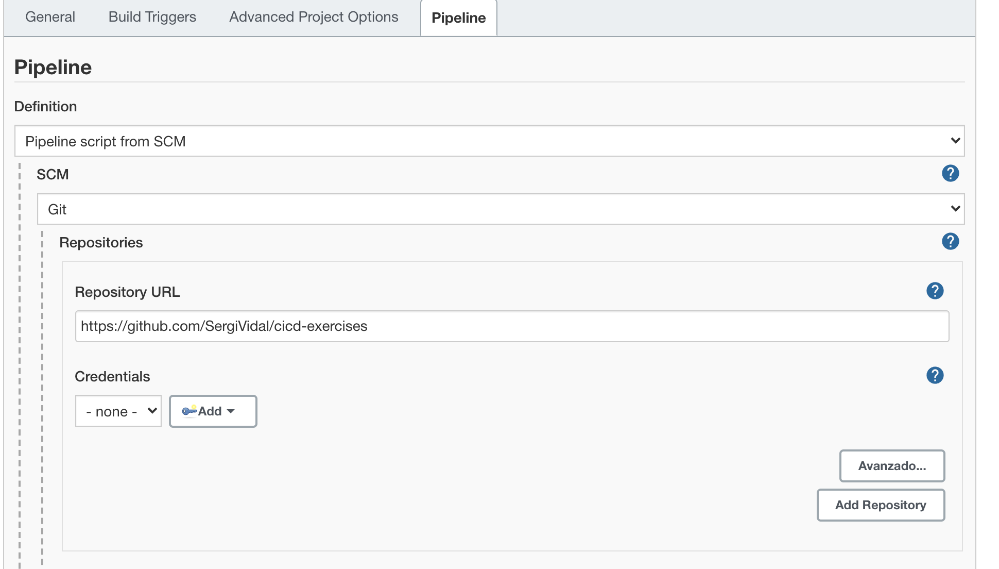
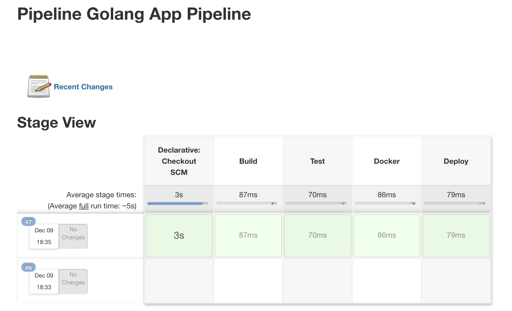
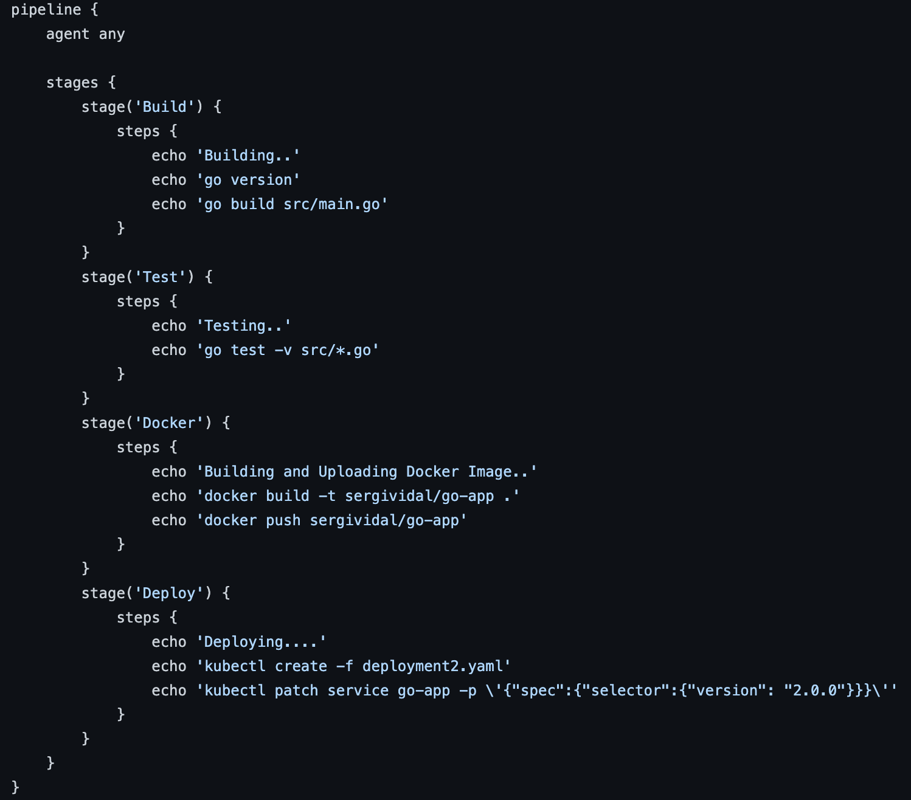
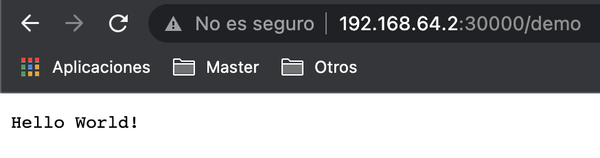

# Configuración de Jenkins

Para levantar Jenkins se debe de utilizar la siguiente imagen: https://hub.docker.com/r/jenkins/jenkins, para ello se ha creado un DockerFile, este se encuentra en: /jenkins/Dockerfile.

A continuación, se debe de hacer el build de la imagen y la creación del contenedor. La primera vez que este sea levantado, será necesario realizar una configuraración inicial en la cual solicitará la password por defecto que se localiza en: /var/jenkins_home/secrets/initialAdminPassword, una vez introducida, preguntará que plugins se desean instalar (con los sugeridos hay suficiente).

```console 
docker build -t jenkins-image .
docker run -d --name jenkins-app -v jenkins_home:/var/jenkins_home -p 8080:8080 -p 50000:50000 jenkins-image
docker exec -it jenkins-app /bin/bash

cat /var/jenkins_home/secrets/initialAdminPassword
```
http://localhost:8080/

Una vez terminada la configuración, se creará una Nueva Tarea, esta será del tipo Pipeline. Durante la configuración, se solicitará la declaración o la vinculación del Jenkinsfile, en mi caso lo he vinculado mediante la URL de mi repositorio de Github, este se encuentra en la raiz: https://github.com/SergiVidal/cicd-exercises. 



A continuación, una vez creada correctamente, se ejecutará la Pipeline, y si todo ha salido satisfactoriamente, aparecerá una imagen similar a la siguiente: 




# Pipeline Stages


## 1. Build

La primera fase de la Pipeline consiste en la compilación de la aplicación en Golang. 

Esta aplicación dispone de una Rest API la cual expone un servicio que al realizar una petición HTTP al endpoint /demo (GET) muestra por pantalla el mensaje: "Hello World!"

* Se ha utilizado el framework Gin (https://github.com/gin-gonic/gin), este permite levantar un servidor en Golang de manera muy sencilla y eficiente.


## 2. Test

La siguiente fase es la encargada de ejecutar los test unitarios y de esta forma poder comprobar el correcto funcionamiento. 

* Se ha utilizado la librería interna Testing (https://pkg.go.dev/testing), la cuál permite realizar diversos test unitarios. En este caso se ha realizado un único test el cual realiza una petición HTTP al endpoint /demo (GET) y comprueba el codigo de la respuesta.

* Se ha utilizado la librería Testify (https://github.com/stretchr/testify), la cuál ofrece diversas herramientas necesarias durante la realización de tests y encaja a la perfección con la propia librería Testing.

## 3. Docker

Esta fase se encarga de compilar la imagen de docker que contiene la Aplicación en Golang (el Dockerfile se encuentra en la raíz del proyecto) y de subirla al Hub de Docker.

## 4. Deploy

Finalmente, en esta última fase se realiza el deployment de la nueva versión de la aplicación mediante la estrategia de despliegue "Blue Green deployment".

Una vez realizado el deployment, se puede acceder al servicio mediante la URL interna de minikube y por el puerto 30000. 

http://192.168.64.2:30000/demo




* NOTA: En esta fase, solamente se realiza la creación del objeto deployment2 (/kubernetes/deployment2.yaml) y se hace el patch de la versión del servicio. Se da por entendido que ya existen con anterioridad los objetos deployment1 (/kubernetes/deployment1.yaml) y service (/kubernetes/service.yaml).

